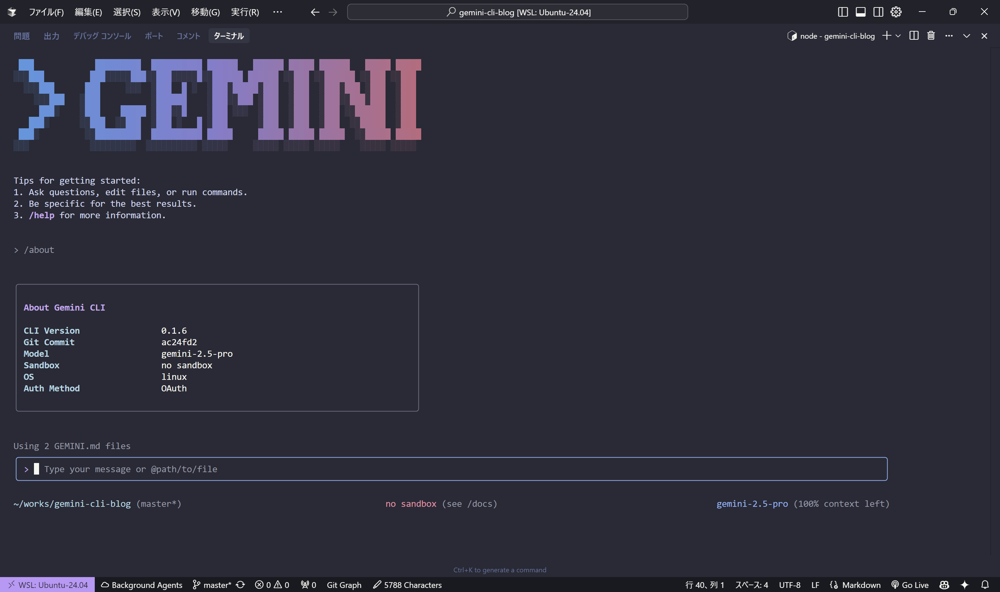

# Gemini CLI実践ガイド：ターミナルでAI開発を効率化する


Claude Codeに高い関心を持っていた。しかし、月額$20の出費を惜しみ、なかなか導入に踏み切れずにいた。
そんな中、GoogleからリリースされたGemini CLIが目に留まった。無料で使える点に惹かれ、早速試してみることにした。
実際に使ってみてこれは単なる「ターミナルでAIが使える」以上の価値があることがわかった。

## なぜターミナルなのか
Web版ChatGPTやClaude、Cursorがあるなかで、なぜコマンドラインなのか。答えは「摩擦の排除」にある。

コードレビュー中にエラーの原因を調べたい時、新しいAPIのサンプルコードが欲しい時、複雑なワンライナーを組み立てたい時。毎回ブラウザを開いてコピペを繰り返すのは非効率だ。ターミナルならパイプやリダイレクトでシームレスに連携できる。

```bash
# ログファイルの異常を即座に分析
! cat error.log | gemini -p "このエラーログの原因を特定して"

```

## セットアップは3分で完了
Claude Codeとは違い、Gemini CLIはwindowsでもWSLなしで動作する。
私は、慣れたコマンドを使いたかったのでWSL環境にセットアップした。

### 事前準備：Node.jsのインストール
Gemini CLIはNode.js（バージョン18以上）環境で動作する。環境にNode.jsがインストールされているか、またバージョンが要件を満たしているかを確認。
```bash
node -v
```
もしインストールされていない、あるいはバージョンが古い場合は、公式サイトや[Node Version Manager (nvm)](https://github.com/nvm-sh/nvm)などを使ってインストールする。

### Gemini CLIのインストールと認証
Node.jsの準備ができたら、次のコマンドでGemini CLIをインストール。
```bash
npm install -g @google/gemini-cli
```
インストール後、`gemini`コマンドを実行すると、初回設定が始まる。

```bash
gemini
```
表示される指示に従い、テーマカラーの選択とGoogleアカウントでの認証を進めれば、準備完了!!

## 実際の使用例

### 1. コードの即座生成と改善
```bash
# 関数生成
> JSONファイルを読み込んで特定のキーでソートするPython関数を作って

# 既存コードの改善
> @utils.py このコードのパフォーマンスを改善して
```
`@`記号でファイルを直接読み込める点が秀逸だ。複数ファイルの同時読み込みも可能で、プロジェクト全体の文脈を理解させられる。

### 2. エラー解決の高速化
```bash
# エラーメッセージを直接調査
! python main.py 2>&1 | gemini -p "このエラーの解決方法は？"
```

### 3. ドキュメント作業の効率化
```bash
# README生成
> @src/ このプロジェクトのREADMEを作成して

# API仕様書の要約
> @api-spec.yaml この仕様書の変更点を前バージョンと比較して
```
技術文書の作成や保守も大幅に効率化される。

### 4. 学習とリサーチの効率化
```bash
# 新しい技術の調査
> React Server Components 2025の最新トレンドを調査し、まとめて

# 複数の設定ファイルを比較
> @config/prod.yaml @config/dev.yaml この2つの設定の違いを表で整理して

# コードベースの理解
> @src/**/*.py このプロジェクトのアーキテクチャを図で説明して
```
GeminiのWebブラウジング機能は思った以上に有用だ。プロンプトに応じて最新のWeb情報を参照し、それを解釈して回答してくれる。

### 5. 自動化スクリプトの生成

```bash
# 定期バックアップスクリプト
> PostgreSQLのバックアップを週次で実行するbashスクリプトを生成して

# 開発環境のセットアップ
> @package.json この依存関係を元にDockerfileを生成して

# ログ監視とアラート
> アクセスログで異常を検知してSlackに通知するPythonスクリプトを生成して
```
特にDevOps周りのスクリプト生成能力は高い。生成されたスクリプトは実用レベルだが、セキュリティチェックは必須だ。

## 詳細な機能検証

### ファイル操作の柔軟性
`@`プレフィックスは思った以上に柔軟
```bash
# 単一ファイル
@main.py

# 複数ファイル
@src/app.py @tests/test_app.py

# ディレクトリ全体
@src/

# ワイルドカード
@*.json

```
ただし、大きなプロジェクトでディレクトリ全体を指定すると、トークン数が膨大になる点は注意が必要だ。

### 対話の継続性
セッション中はコンテキストが保持される。これにより、段階的な改善が可能
```bash
# 1回目
> SQLiteデータベースを操作するPythonクラスを作成して

# 2回目（コンテキスト継続）
> さっきのクラスにトランザクション機能を追加して

# 3回目
> エラーハンドリングも強化して
```
これは長時間の開発作業では非常に有効だ。

### 出力フォーマットの制御
```bash
# JSON形式での出力
> このAPIレスポンスの構造をJSON Schemaで出力  @api-response.json 

# CSV形式での出力
> このデータをCSV形式に変換して保存 @user-data.csv

# シェルスクリプト
> Gitリポジトリの健全性チェックをするシェルスクリプトを生成して --format bash
```
出力フォーマットの指定により、後続の処理との連携が格段に向上する。

## 制限事項と対策

### 無料枠の現実
1分60回、1日1,000回の制限は、継続的な開発作業では意外と早く到達する。特に大きなファイルを扱う際はトークン消費が激しい。

### 精度の課題と対処法
コード生成の精度は確実に向上しているが、依然として検証は必要だ。特に以下の点で注意が必要
- **最新ライブラリの使用法**: 新しいAPIの仕様は不正確な場合がある
- **エッジケースの処理**: 異常系の処理が甘い傾向
- **セキュリティ考慮**: 入力値検証やSQLインジェクション対策が不十分
対処法として、生成されたコードは必ずレビューし、テストをしてから運用に投入する。

### ネットワーク依存の課題
当然だが、オフライン環境では使用できない。また、ネットワークが不安定な環境では応答が遅くなることがある。ローカルLLMとの併用も検討したいところだ。

## パフォーマンス分析
リリース直後ということもあり、応答速度にはバラつきがある。
- **シンプルな質問**: 1-2秒
- **コード生成**: 3-5秒  
- **ファイル解析**: 5-10秒（ファイルサイズに依存）
- **複雑な推論**: 10-15秒
ピーク時間帯（日本時間の夕方）は若干遅くなる傾向があるが、実用に支障はない。

## 開発ワークフローとの統合例

### CI/CDパイプラインでの活用
```bash
# テストカバレッジの分析
! coverage report | gemini -p "カバレッジ不足の重要な箇所を特定して"

# デプロイ前チェックリスト生成
> @deployment-config.yaml この設定での本番デプロイ時のチェックリストを生成して
```

### コードレビューの支援
```bash
# 差分の分析
! git diff main | gemini -p "このPRの変更点とリスクを評価して"

# セキュリティチェック
> @new-feature.py セキュリティ脆弱性をチェックして
```

### ドキュメント保守の自動化
```bash
# API仕様の更新検知
> @old-api.yaml @new-api.yaml API変更点を changelog形式で出力して

# README同期チェック
> @README.md @src/ READMEとコードの整合性をチェックして
```

### セキュリティ考慮事項
企業利用ではデータポリシーの確認が重要だ。GoogleのAPI利用規約では、API経由の入力はモデルの学習に使用されないと明記されている。しかし、CLIツールがどの規約に準拠するかは、常に公式ドキュメントで最新の情報を確認すべきである。機密性の高いコードを扱う場合は、有料版の利用や利用規約の詳細な確認が推奨される。

## 他ツールとの使い分け
- **単発の質問**: Gemini, ChatGPT, Perplexity
- **文章生成**: Claude
- **コーディング**: Claude Code
- **ワークフロー統合**: Gemini CLI
- **チーム共有**: ChatGPT Plus（GPTs活用）
Gemini CLIの強味は「Web検索を簡単に既存の開発フローに溶け込ませることができる」点にある。

## 実践的なワークフロー
実際に私が採用している使い方を紹介する：
```bash
# 朝のルーチン：昨日のコミットを要約
! git log --oneline -10 | gemini -p "昨日の作業内容をまとめて"

# 開発中：新機能の設计
> @requirements.txt このプロジェクトに認証機能を追加するアーキテクチャを提案して

# 終業前：課題の整理
> @TODO.md 明日優先すべきタスクをピックアップして
```

## 今後の期待と課題
GoogleのAI戦略における位置づけを考えると、Gemini CLIは重要な実験的プロダクトといえる。他のGoogle製品との統合可能性も高く、今後の発展に期待したい。

現時点で改善を期待したい機能
### 技術的な改善点
- **ローカルLLMとの選択可能性**: オフライン作業対応
- **より柔軟な出力フォーマット制御**: JSON、XML、YAML等の構造化出力
- **プラグインシステム**: カスタム機能の追加

### エンタープライズ機能
- **監査ログ**: セキュリティ要件への対応  
- **カスタムモデル**: 企業固有のファインチューニング
- **オンプレミス版**: 完全にローカルな環境での実行

## 競合ツールとの詳細比較

### Claude Code vs Gemini CLI
**Claude Code の優位点**
- コード生成精度が高い
- 自律的に考える能力
- エラー修正能力が高い

**Gemini CLI の優位点**
- 無料で利用可能
- Google検索との連携
- プロンプトに忠実

### GitHub Copilot CLI vs Gemini CLI

**GitHub Copilot CLI の優位点:**
- IDEとの深い統合
- コード補完に特化
- エンタープライズサポート

**Gemini CLI の優位点:**
- より自然な対話
- ファイル操作の柔軟性
- Web検索機能
- 汎用的なタスクに対応

## 実際の活用事例

### ケース1: レガシーコードのリファクタリング
```bash
# 古いPythonコードの分析
> @legacy_module.py このコードの問題点と改善案を教えて

# 段階的な改善
> まず型ヒントを追加したバージョンを作成して
> 次にエラーハンドリングを改善して
> 最後にテストコードを生成して
```

### ケース2: 新技術の学習
```bash
# 最新情報の収集
> googleでWebAssembly 2025 performanceを調べて要点をまとめて

# 実践的な学習
> WebAssemblyのRustバインディングの簡単な例を教えて

# 理解度チェック
> WebAssemblyのQ&Aを作成して
```

### ケース3: 障害対応
```bash
# ログ分析
! tail -1000 /var/log/application.log | gemini -p "エラーパターンを分析"

# 原因調査
> @config/database.conf このDB設定で起こりうる問題は？

# 対策立案
> メモリリークの対策をPythonで実装して
```

## まとめ
Gemini CLIはまだまだ未熟で「完璧なツール」ではない。しかし「開発フローを変える」可能性を秘めている。
Googleの資本力を背景に持ち、オープンソースとして劇的に進化していくことだろう。(Remember, BARD!)

重要なのは、これを単体で使おうとせず、既存のツールチェーンの一部として組み込むことだ。ターミナルベースの開発スタイルが身についているなら、試してみる価値は十分にある。

無料で始められるので、まずは1週間使ってみることをお勧めする。あなたの開発スタイルにマッチするかどうかは、実際に使ってみないとわからない。

---

*この記事はGemini CLIのリリース直後から3日間集中的に検証した結果をもとに執筆しています。今後のアップデートにより動作や機能が変更される可能性があります。*